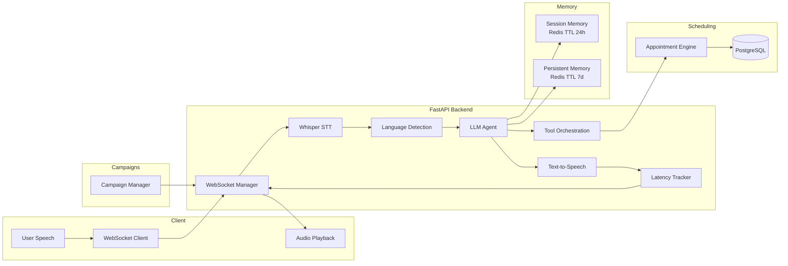

# System Architecture — 2Care.ai Voice AI Agent

## High-Level Pipeline

## Component Responsibilities

| Component | Role |
|-----------|------|
| **Whisper STT** | Converts voice input to text |
| **Language Detection** | Auto-detects English, Hindi, Tamil |
| **LLM Agent** | Interprets intent; drives dialogue |
| **Tool Orchestration** | `checkAvailability`, `book`, `cancel`, `reschedule` |
| **Appointment Engine** | Conflict detection, past-time validation, alternatives |
| **Session Memory** | Current conversation context (pending intent, slots) |
| **Persistent Memory** | Patient preferences, last doctor, preferred language |
| **Campaign Manager** | Outbound reminders via scheduled tasks + WebSocket push |
| **Latency Tracker** | Logs per-stage and end-to-end timings |

## Latency Measurement

End-to-end metric: **speech end → first audio response** (`e2e_speech_to_audio_ms`).

| Stage | Target (ms) |
|-------|-------------|
| Speech-to-text | ≤ 120 |
| Agent reasoning | ≤ 200 |
| Text-to-speech | ≤ 100 |
| **Total** | **< 450** |

Logs are written at `INFO` level with JSON breakdown per session.

## Memory Design

**Session memory** (`session:{id}:messages`, `session:{id}:state`)
- Short TTL (24 hours)
- Tracks multi-turn booking flow (doctor → date → time)

**Persistent memory** (`patient_context:{phone}`)
- Long TTL (7 days)
- Stores `preferred_language`, `last_doctor`, `preferred_hospital`

## Export Diagram for Submission

Open this file in VS Code / GitHub to render Mermaid, or export to PNG using [mermaid.live](https://mermaid.live).
